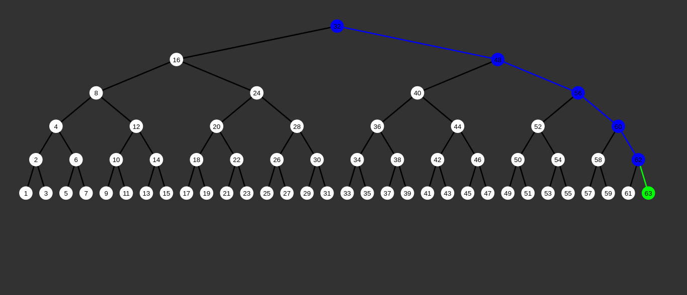
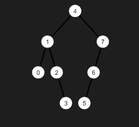
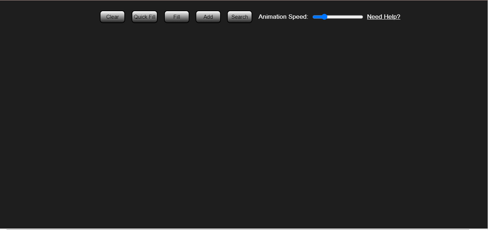
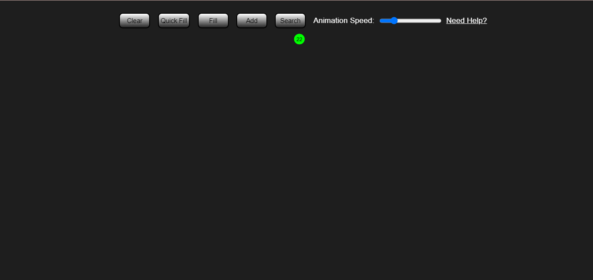
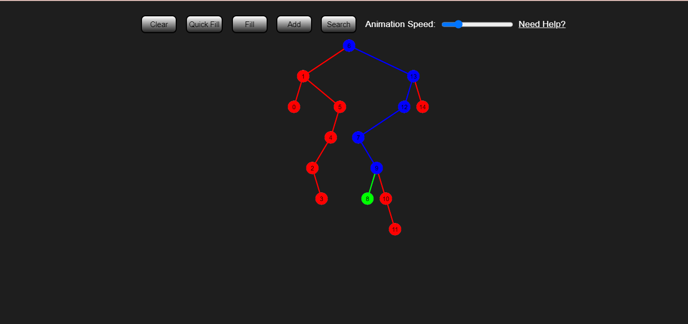
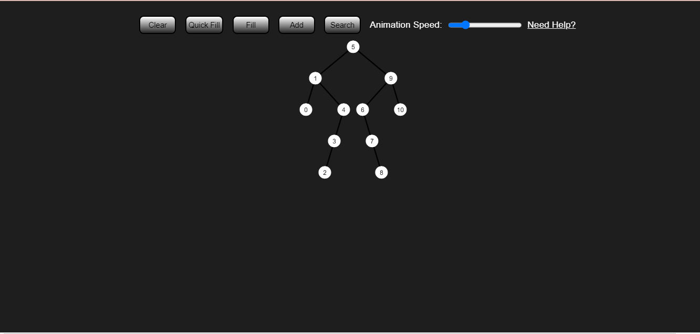
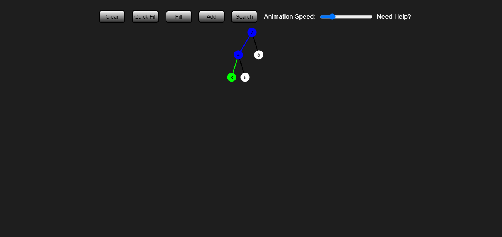

# 🌳 Binary Tree Visualization

📌 **Add and search for nodes in a binary tree with an easy-to-use, web-based visualization.**



---

## 📖 What is a Binary Tree?

A **Binary Tree** is a data structure where every node can have at most **two children**:
- The **left child** contains a value **less than** the parent node.
- The **right child** contains a value **greater than** the parent node.



---

## 🎯 Features
✅ **Insert Nodes** - Dynamically add nodes to the tree.  
✅ **Animated Visualization** - Watch real-time animations of node insertion and searching.  
✅ **Search Functionality** - Find any value in the tree with visual indicators.  
✅ **Pan & Zoom** - Navigate the tree easily.  
✅ **Speed Control** - Adjust animation speed with a slider.  
✅ **Quick Fill** - Instantly populate the tree with random values.  
✅ **Clear Tree** - Reset the visualization instantly.  

---

## 🚀 Using the Visualization

### 🏁 Initial Screen
When you first open the visualization, the screen will be **empty**.



### ➕ Adding Nodes
1. Click the **Add** button.
2. Enter an integer value for the node.
3. Watch the node being added with an animation.
   - 🟢 **Green** represents the newly added node.
   - 🔵 **Blue** represents visited nodes while finding the correct position.



### 🔍 Searching for a Value
1. Click the **Search** button.
2. Enter a number previously inserted.
3. The tree highlights the search path:
   - 🔵 **Blue** - Nodes visited during search.
   - 🔴 **Red** - Paths where the value was not found.
   - 🟢 **Green** - Node found.



### 🔄 Filling the Tree
- Click **Fill** to populate the tree with a specified number of nodes.
- Click **Quick Fill** for an **instant** fill without animations.



### 🗑️ Clearing the Tree
Click the **Clear** button to remove all nodes and reset the visualization.



---

## 🛠️ Code Structure

📂 **Project Files Overview**

| File Name | Description |
|-----------|------------|
| `Node.js` | Defines the `Node` class, storing values, child nodes, and display properties. |
| `Tree.js` | Implements the `Tree` class, handling insertion, searching, and animations. |
| `Controls.js` | Manages UI interactions, connecting buttons to tree functions. |
| `Explorer.js` | Handles panning and zooming for better visualization control. |
| `sketch.js` | Initializes and runs the visualization. |

---

## 📌 Installation & Usage

1️⃣ Clone the repository:
```sh
 git clone https://github.com/your-username/binary-tree-visualization.git
```

2️⃣ Open the project folder:
```sh
 cd binary-tree-visualization
```

3️⃣ Open `index.html` in your browser to start the visualization.

---

## 🎨 Screenshots
| Insertion Animation | Search Visualization |
|---------------------|---------------------|
|  |  |

---

## 💡 Future Improvements
🔹 Enhanced **color customization** for better user experience.  
🔹 Implementing **AVL Tree balancing** feature.  
🔹 Adding **user-defined traversal** options.  

---


Built with
p5.js - A library for creating visualizations using the canvas
Future Ideas
Make the tree self-balancing using AVL tree rotation
Add an animation for removing a node from the tree
Improve the performance of the Explorer class for larger trees with svg
